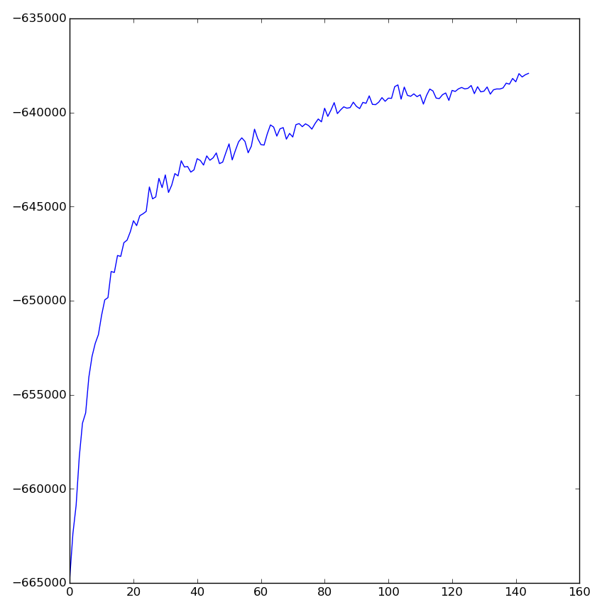

===============
Getting started
===============

The following demonstrates how to inspect a model of a subset of the Reuters
news dataset. The input below, ``X``, is a document-term matrix (sparse matrices
are accepted).

.. code-block:: python

    >>> import numpy as np
    >>> import lda
    >>> X = lda.datasets.load_reuters()
    >>> vocab = lda.datasets.load_reuters_vocab()
    >>> titles = lda.datasets.load_reuters_titles()
    >>> X.shape
    (395, 4258)
    >>> X.sum()
    84010
    >>> model = lda.LDA(n_topics=20, n_iter=1500, random_state=1)
    >>> model.fit(X)  # model.fit_transform(X) is also available
    >>> topic_word = model.topic_word_  # model.components_ also works
    >>> n_top_words = 8
    >>> for i, topic_dist in enumerate(topic_word):
    ...     topic_words = np.array(vocab)[np.argsort(topic_dist)][:-n_top_words:-1]
    ...     print('Topic {}: {}'.format(i, ' '.join(topic_words)))
    Topic 0: british churchill sale million major letters west
    Topic 1: church government political country state people party
    Topic 2: elvis king fans presley life concert young
    Topic 3: yeltsin russian russia president kremlin moscow michael
    Topic 4: pope vatican paul john surgery hospital pontiff
    Topic 5: family funeral police miami versace cunanan city
    Topic 6: simpson former years court president wife south
    Topic 7: order mother successor election nuns church nirmala
    Topic 8: charles prince diana royal king queen parker
    Topic 9: film french france against bardot paris poster
    Topic 10: germany german war nazi letter christian book
    Topic 11: east peace prize award timor quebec belo
    Topic 12: n't life show told very love television
    Topic 13: years year time last church world people
    Topic 14: mother teresa heart calcutta charity nun hospital
    Topic 15: city salonika capital buddhist cultural vietnam byzantine
    Topic 16: music tour opera singer israel people film
    Topic 17: church catholic bernardin cardinal bishop wright death
    Topic 18: harriman clinton u.s ambassador paris president churchill
    Topic 19: city museum art exhibition century million churches

The document-topic distributions are available in ``model.doc_topic_``.

.. code-block:: python

    >>> doc_topic = model.doc_topic_
    >>> for i in range(10):
    ...     print("{} (top topic: {})".format(titles[i], doc_topic[i].argmax()))
    0 UK: Prince Charles spearheads British royal revolution. LONDON 1996-08-20 (top topic: 8)
    1 GERMANY: Historic Dresden church rising from WW2 ashes. DRESDEN, Germany 1996-08-21 (top topic: 13)
    2 INDIA: Mother Teresa's condition said still unstable. CALCUTTA 1996-08-23 (top topic: 14)
    3 UK: Palace warns British weekly over Charles pictures. LONDON 1996-08-25 (top topic: 8)
    4 INDIA: Mother Teresa, slightly stronger, blesses nuns. CALCUTTA 1996-08-25 (top topic: 14)
    5 INDIA: Mother Teresa's condition unchanged, thousands pray. CALCUTTA 1996-08-25 (top topic: 14)
    6 INDIA: Mother Teresa shows signs of strength, blesses nuns. CALCUTTA 1996-08-26 (top topic: 14)
    7 INDIA: Mother Teresa's condition improves, many pray. CALCUTTA, India 1996-08-25 (top topic: 14)
    8 INDIA: Mother Teresa improves, nuns pray for "miracle". CALCUTTA 1996-08-26 (top topic: 14)
    9 UK: Charles under fire over prospect of Queen Camilla. LONDON 1996-08-26 (top topic: 8)

Document-topic distributions may be inferred for out-of-sample texts using the
``transform`` method:

.. code-block:: python

    >>> X = lda.datasets.load_reuters()
    >>> titles = lda.datasets.load_reuters_titles()
    >>> X_train = X[10:]
    >>> X_test = X[:10]
    >>> titles_test = titles[:10]
    >>> model = lda.LDA(n_topics=20, n_iter=1500, random_state=1)
    >>> model.fit(X_train)
    >>> doc_topic_test = model.transform(X_test)
    >>> for title, topics in zip(titles_test, doc_topic_test):
    ...     print("{} (top topic: {})".format(title, topics.argmax()))
    0 UK: Prince Charles spearheads British royal revolution. LONDON 1996-08-20 (top topic: 7)
    1 GERMANY: Historic Dresden church rising from WW2 ashes. DRESDEN, Germany 1996-08-21 (top topic: 11)
    2 INDIA: Mother Teresa's condition said still unstable. CALCUTTA 1996-08-23 (top topic: 4)
    3 UK: Palace warns British weekly over Charles pictures. LONDON 1996-08-25 (top topic: 7)
    4 INDIA: Mother Teresa, slightly stronger, blesses nuns. CALCUTTA 1996-08-25 (top topic: 4)
    5 INDIA: Mother Teresa's condition unchanged, thousands pray. CALCUTTA 1996-08-25 (top topic: 4)
    6 INDIA: Mother Teresa shows signs of strength, blesses nuns. CALCUTTA 1996-08-26 (top topic: 4)
    7 INDIA: Mother Teresa's condition improves, many pray. CALCUTTA, India 1996-08-25 (top topic: 4)
    8 INDIA: Mother Teresa improves, nuns pray for "miracle". CALCUTTA 1996-08-26 (top topic: 4)
    9 UK: Charles under fire over prospect of Queen Camilla. LONDON 1996-08-26 (top topic: 11)

(Note that the topic numbers have changed due to LDA not being an `identifiable
<https://en.wikipedia.org/wiki/Identifiability>`_ model. The phenomenon is
known as `label switching
<http://onlinelibrary.wiley.com/doi/10.1111/1467-9868.00265/abstract>`_ in the
literature.)

Convergence may be monitored by accessing the ``loglikelihoods_`` attribute on a
fitted model. The attribute is bound to a list which records the sequence of
log likelihoods associated with the model at different iterations (thinned by
the ``refresh`` parameter).

(The following code assumes `matplotlib <http://matplotlib.org/>`_ is installed.)

.. code-block:: python

    >>> import matplotlib.pyplot as plt
    >>> # skipping the first few entries makes the graph more readable
    >>> plt.plot(model.loglikelihoods_[5:])

Judging convergence from the plot, the model should be fit with a slightly
greater number of iterations.
